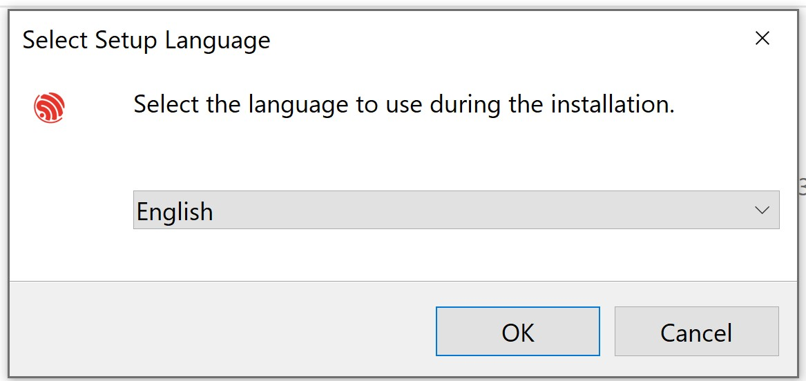
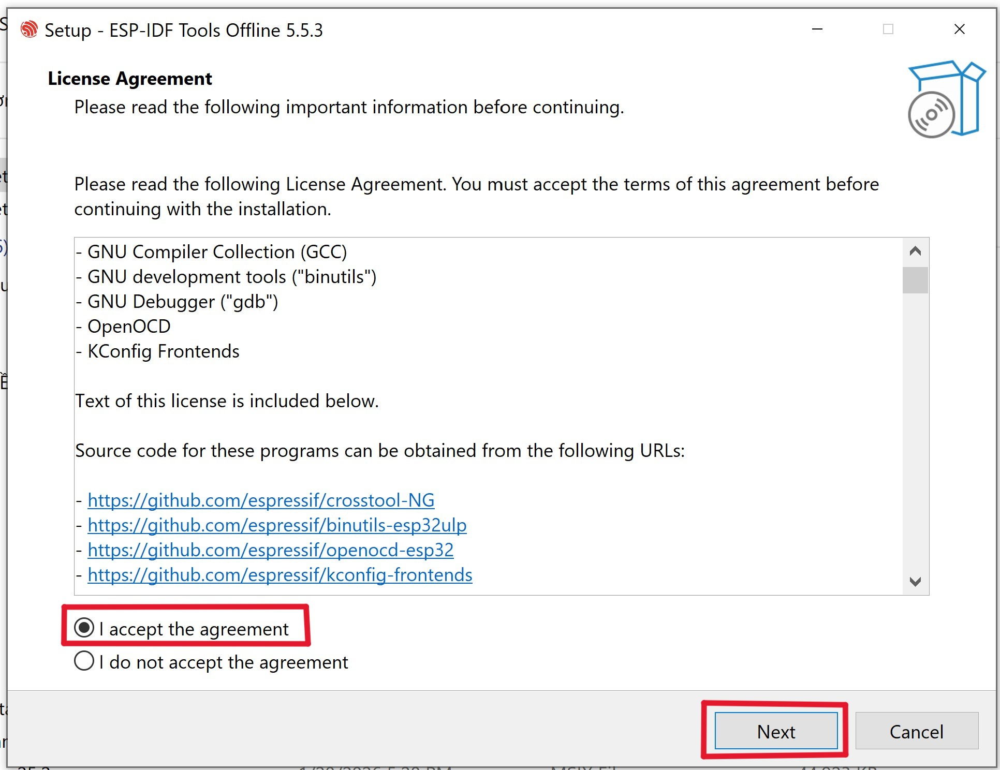
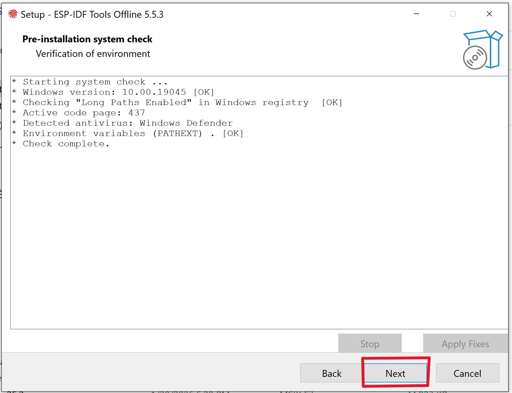
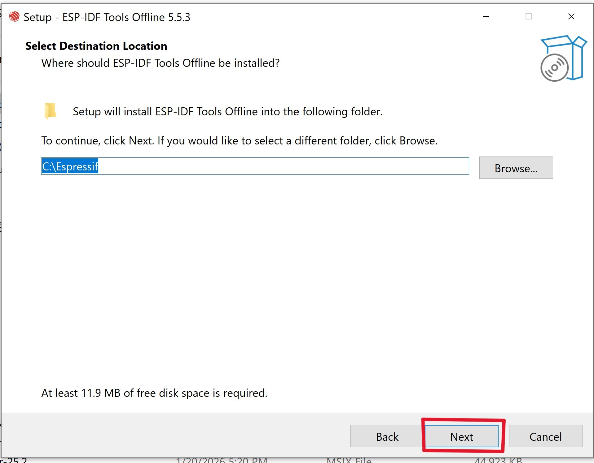
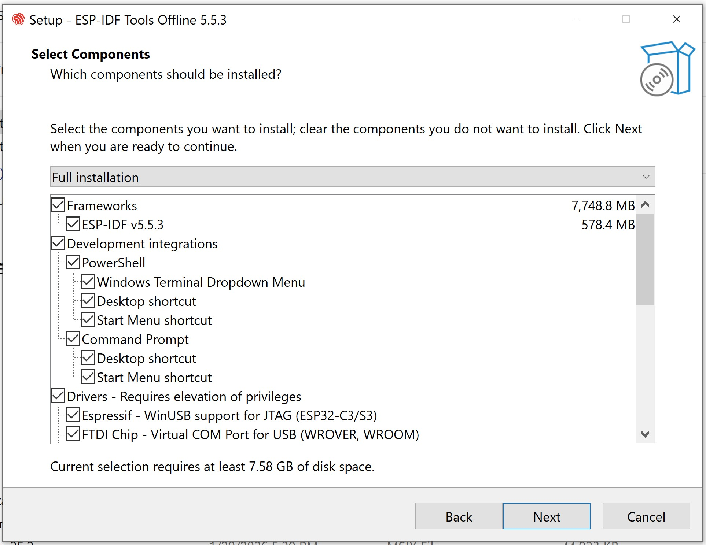
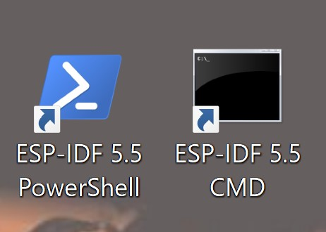
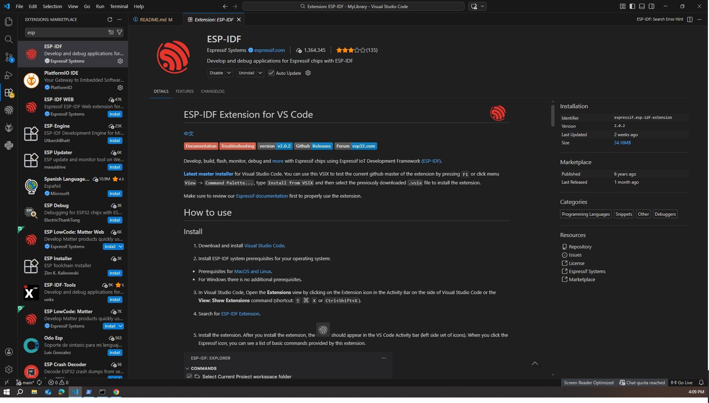
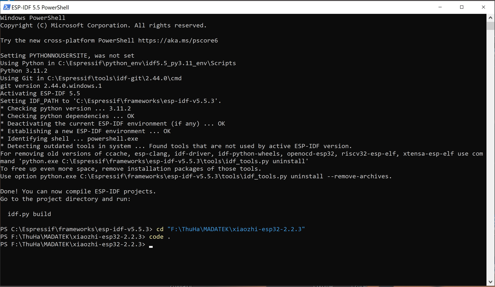
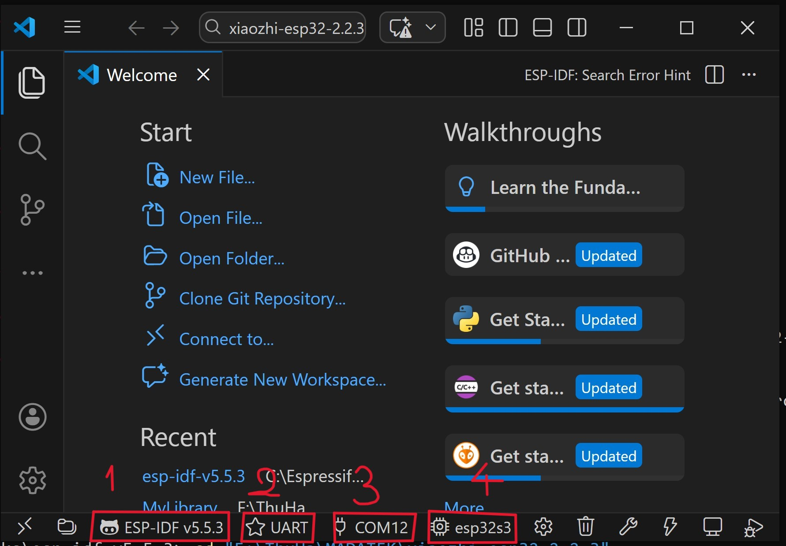

# MyLibrary _ ESP-IDF

## ESP-IDF là gì?

**1. Là gì?**

ESP-IDF là khung phát triển IoT chính thức của Espressif dành cho các dòng SoC ESP32, ESP32-S, ESP32-C và ESP32-H. Nó cung cấp một bộ SDK hoàn chỉnh cho việc phát triển bất kỳ ứng dụng thông thường nào trên các nền tảng này, sử dụng các ngôn ngữ lập trình như C và C++. Hiện tại, ESP-IDF đang cung cấp sức mạnh cho hàng triệu thiết bị đang hoạt động và cho phép xây dựng nhiều sản phẩm kết nối mạng khác nhau, từ bóng đèn và đồ chơi đơn giản đến các thiết bị gia dụng lớn và thiết bị công nghiệp.

**2. Có mã nguồn mở**

ESP-IDF được cung cấp miễn phí trên GitHub. Phần lớn các thành phần trong ESP-IDF có sẵn dưới dạng mã nguồn theo giấy phép Apache 2.0. Các thành phần của bên thứ ba được cung cấp theo giấy phép tương thích.

**3. Các thành phần phần mềm giàu tính năng**

ESP-IDF hỗ trợ một lượng lớn các thành phần phần mềm, bao gồm hệ điều hành thời gian thực (RTOS), trình điều khiển thiết bị ngoại vi, ngăn xếp mạng, các triển khai giao thức khác nhau và các công cụ hỗ trợ cho các trường hợp sử dụng ứng dụng phổ biến. Các thành phần này giúp các nhà phát triển tập trung vào logic nghiệp vụ, trong khi SDK cung cấp hầu hết các khối xây dựng cần thiết cho các ứng dụng điển hình. Các công cụ phát triển mã nguồn mở và miễn phí, cũng như các IDE Eclipse và VSCode được hỗ trợ chính thức, đảm bảo tính dễ sử dụng cho các nhà phát triển.

**ESP_IDF có các thành phần phần mềm và các tính năng như sau:**

    Cung cấp mạng
    Thư viện nâng cấp OTA
    Các giao thức mạng phổ biến
    Hệ thống tệp
    Lưu trữ đối tượng
    Hỗ trợ POSIX và C++
    Thư viện mật mã
    Plugin IED
    Trình điều khiển thiết bị ngoại vi
    Mạng lưới Wi-Fi & Bluetooth LE Mesh
    Hỗ trợ SoC
    ......

## Hướng dẫn cài đặt ESP-IDF

### I. Cài đặt esp-idf

**1. Tải xuống file ESP-IDF sau đây:**

    1. esp-idf-tools-setup-offline-5.4.3

    2. esp-idf-tools-setup-offline-5.5.3

Trong: https://drive.google.com/drive/folders/1LGvL_WyAwU0z-d0AJixj9mp80m07RM1k

**Note:** 

- Chú ý yêu cầu version idf. Ví dụ với folder xiaozhi-esp32-2.2.3, code trong đây yêu cầu bản idf 5.5 đổ lên mới sử dụng được.

- Để sử dụng cho ***xiaozhi-esp32-2-2-3*** thì tải ***file ESP-IDF esp-idf-tools-setup-offline-5.5.3***

**2. Cài đặt**

**Bước 1:** Chọn OK

 

**Bước 2:** Chọn "I accept the agreement" rồi Next

 

**Bước 3:** Chọn Next

 

**Bước 4:** Chọn Next

 

**Bước 5:** Chọn Next

 

**Bước 6:** Chọn Install rồi đợi cài đặt ESP-IDF, thời gian đợi tầm 10-15 phút

 

**Bước 7:** Chọn Finish

 

Sau khi tải xong trên màn hình chính của máy tính sẽ xuất hiện 2 file: `ESP-IDF 5.5 PowerShell` và `ESP-IDF 5.5 CMD`. 2 file này sẽ được mở lên tự động ngay sau khi hoàn tất quá trình tải.



### II. Sử dụng esp-idf

**1. Cài đặt môi trường idf trên Visual Studio Code**

Để sử dụng được idf trên VSCode, cần cài đặt môi trường cho nó. Để cài đặt môi trường idf trên VSCode, vào **EXTENSIONS** rồi gõ tìm kiếm *"esp-idf"* và tải bản có dấu xanh của ***espressif Systems***.



**2. Sử dụng**

***Bước 1:*** PowerShell

IDF sử dụng bằng cách gõ lệnh trên **PoweShell** của IDF. Các bước và lệnh cơ bản như sau:

- Trỏ vào vị trí thư mục cần chạy code, bạn gõ lệnh sau đó Enter. Nếu như bạn lưu **ESP-IDF** (ở bước 4) cùng folder với file muốn chạy code thì không cần mục này. Lệnh: 
```
cd "<Đường dẫn vào thư mục>" 
```

- Mở file code trong thư mục để chạy, lệnh: 
```
code .
``` 
sau đó Enter.

***Ví dụ:*** 
```
cd "F:\ThuHa\MADATEK\xiaozhi-esp32-2.2.3"
```



**Note:** Cần phải thực hiện các bước này, nếu như không có các bước này bên PowerShell của idf thì không thể chạy trực tiếp code bằng cách mở file/folder trong VSCode như bình thường.

***Bước 2:*** Visual Studio Code

Để chạy file, cần setup version IDF, cổng nạp, COM, loại ESP32. Chọn ***Select curent ESP-IDF version***(1) để setup version idf phù hợp. Chọn ***Select Flash Method*** để setup giao thức phù hợp(2). Chọn ***Select Port to Use*** để setup cổng COM phù hợp(3). Chọn ***Espressif Device Target*** để setup bản ESP32 đang sử dụng(4).



Sau khi setup xong bấm tổ hợp phím ***Ctrl + Shift + P*** rồi chọn ***ESP-IDF: Build, Flash and Start a Monitor on Your Device*** để Build hoặc nạp code. Ngoài ra có thể bấm tổ hợp ***Ctrl + E + D***.