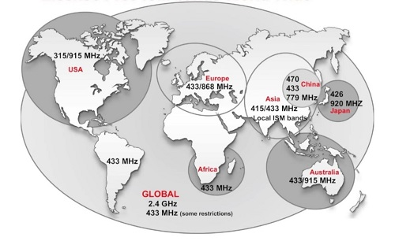

# Mạng không dây Sub-GHz

### Mạng không dây Sub-GHz là gì?

#### Dải tần

Mạng không dây Sub-GHz hoạt động ở dải tần nhỏ hơn 1 GHz.

Phạm vi hoạt động của Sub-GHz xa hơn cũng như năng lượng tiêu thụ thấp hơn wifi hay bluetooth - Đi kèm tốc độ truyền chậm hơn.

Sub-GHz sử dụng tiêu chuẩn IEEE 802.15.4g

Ta được biết, tần số thực tế ở các khu vực khác nhau trên thế giới là khác nhau. Các quốc gia trên thế giới chủ yếu sử dụng **dải tần miễn phí cấp phép 433MHz**. Khác với wifi với bluetooth sử dụng cùng băng tần 2.4 GHz ở mọi nơi trên TG, **Sub-GHz** sử dụng các dải tần khác nhau trên thế giới do lịch sử xung quanh việc điều chỉnh các dải tần số.

***Ví dụ:*** Bắc Mỹ/Úc - 915MHz, Châu Âu - 868MHz, Trung Quốc - 470MHz/779MHz, Nhật Bản - 426MHz/920MHz

*Băng tần ISM Sub-GHz miễn phí trên thế giới*

#### Phạm vi của Sub-GHz

Sub-GHz có thể dễ dàng đạt được vài trăm mét trong nhà và vài km (dặm) ngoài trời, tùy thuộc vào điều kiện.

Sub-GHz có tần số thấp, bước sóng dài nên dễ dàng lan truyền qua các vật cản như tường, cây cối, tòa nhà trong các đô thị và trong nhà máy. Bước sóng dài của Sub-GHz làm cho ít suy hao đường truyền nên truyền đi được xa hơn.

#### Năng lượng

Sub-GHz sử dụng băng tần hẹp và tốc độ truyền thấp nên tiêu thụ ít năng lượng. Sub-GHz cần tín hiệu năng lượng thấp từ bộ truyền cho cùng một tín hiệu ở bộ nhận nên Sub-GHz phù hợp cho các thiết bị cảm biến IoT dùng pin. Một viên pin có thể cấp năng lượng cho cảm biến Sub-GHz lên tới 10-20 năm. Sub-GHz hoạt động ở dải tần thấp hơn và có rất ít thiết bị wireless hoạt động ở dải tần này nên sẽ chống nhiễu tốt hơn.

### Ứng dụng

**Công nghệ Sub-GHz** giúp triển khai mạng cảm biến không dây một cách nhanh chóng và đơn giản. Cảm biến không dây đã được cấp nguồn bằng pin và kết nối không dây nên không cần đi cáp tín hiệu hay cấp nguồn gì. Việc triển khai mạng không dây Sub-GHz mang lại ưu điểm vượt trội với các nhà máy, tòa nhà, và cơ sở vật chất đang hoạt động vì không cần phải cắt điện phục vụ thi công kéo cáp tín hiệu và cáp nguồn nên không làm gián đoạn hoạt động của các nhà máy, tòa nhà và cơ sở vật chất. Bên cạnh đó, công nghệ Sub-GHz giúp cho việc vận hành, bảo trì mạng không dây rất dễ dàng và thuận tiện.

**Ứng dụng:** 

Các ngành năng lượng, nông nghiệp, y tế, sản xuất và các ngành công nghiệp khác sử dụng mạng cảm biến không dây Sub-GHz như là giải pháp kết nối để gửi dữ liệu định kỳ và khối lượng dữ liệu nhỏ. 

Mạng cảm biến Sub-GHz phù hợp cho ứng dụng công nghiệp quá trình, tòa nhà, thành phố thông minh (chiếu sáng, đỗ xe, điều khiển giao thông, đọc công tơ năng lượng). Các ứng dung cụ thể bao gồm: mạng năng lượng thông minh, tòa nhà thông minh, giám sát cơ sở vật chất, đồng hồ đo thông minh, đo lường tự động hóa từ xa nhà máy, nông nghiệp thông minh và ngành ngư nghiệp, giám sát tội phạm và thiên tai, nhà thông minh, giám sát người già, trẻ em và người bệnh.

Trong ngành nông nghiệp, mạng cảm biến Sub-GHz sử dụng để kết nối các cảm biến về điều kiện không khí, chất lượng nước, thời tiết. Mạng mạng cảm biến Sub-GHz kết nối các cảm biến khói, chuyển động, cảm biến cửa, phát hiện xâm nhập, điều khiển chiếu sáng và điều hòa không khí trong tòa nhà. Ngoài ra, mạng Sub-GHz ứng dụng để giám sát các đồng hồ nước, đồng hồ Gas, đồng hồ điện và đồng hồ nhiệt lượng trong ứng dụng giám sát năng lượng.