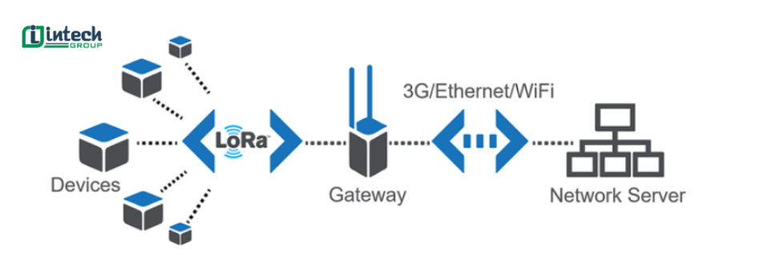

# LoRa

## LoRa là gì?

**LoRa - Long Range**
 
LoRa là 1 công nghệ truyển thông không dây tầm xa, tiêu thụ năng lượng thấp. Hoạt động trên băng tần [Sub-GHz](<Băng tần Sub-GHz>) như: 433MHz, 868MHz (châu Âu), 915MHz (Mỹ), giúp truyền dữ liệu đi xa hơn mà không cần tăng công suất phát sóng.

Công nghệ LoRa được phát triển bởi Semtech Corporation

## Nguyên lý hoạt động của LoRa

CN LoRa được phát triển dựa trên nền tảng kỹ thuật điều chế Chirp Spread Spectrurm (CSS), LoRa có khả năng kết nối giữa các thiết bị IoT với nhau. **Nguyên lý hoạt động** của LoRa dựa trên cách điều chế tín hiệu, giúp truyền tải dữ liệu một cách hiệu quả ngay cả trong môi trường ***độ nhiễu cao***.

### Một số thông tin về kỹ thuật điều chế Chirp Spread Spectrum

CN LoRa sử dụng kỹ thuật điều chế Chirp Spread Spectrum (CSS). 

CSS sử dụng các xung tần số cao để chĩa nhỏ dữ liệu, tạo tín hiệu có dải tần rộng hơn so với dải tần của dữ liệu gốc. Trước khi truyền đi từ anten, các tín hiệu này sẽ được mã hóa thành các chuỗi tín hiệu Chirp.

Tín hiệu chirp là các tín hiệu hình ***sin*** thay đổi tần số theo thời gian. 

CSS có khả năng truyền dữ liệu qua những khoảng các h xa, đồng thời duy trì khả năng nhận tín hiệu ngay cả khi cường độ tín hiệu thấp hơn độ nhiễu xung quanh.

### Tín hiệu chirp

## TÀI LIỆU THAM KHẢO

#### Link web: 

1. https://intech-group.vn/lora-la-gi-nguyen-ly-hoat-dong-ra-sao-bv938.htm?gad_source=1&gad_campaignid=23136128043&gbraid=0AAAAAphSSNGluDRPk0D9F0owS1i0GYqYW&gclid=Cj0KCQiAwYrNBhDcARIsAGo3u33KsBK39RUtADhzncXYSP0CxZ7GB3CMBHkLjmbIUO_5ryD5yy3zO-0aAqIxEALw_wcB